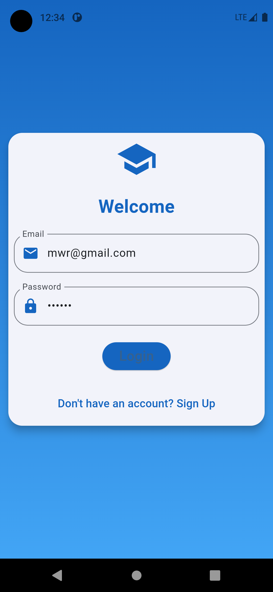
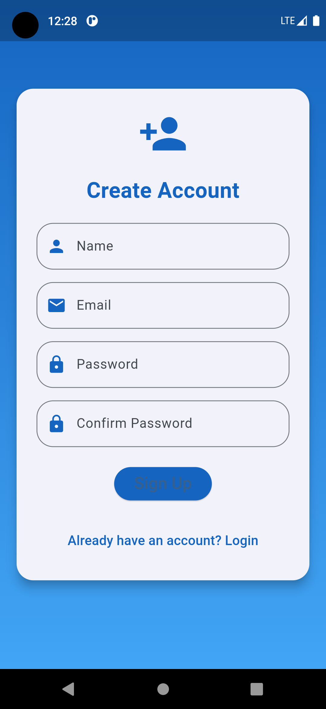
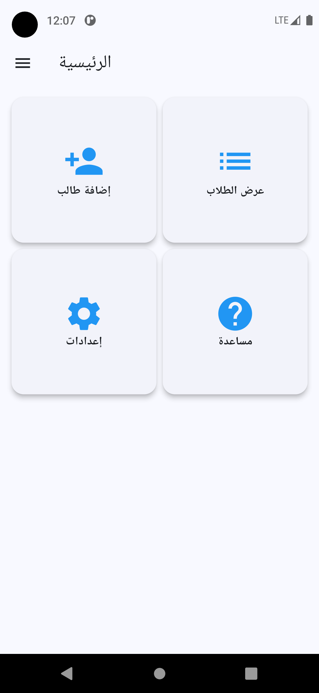
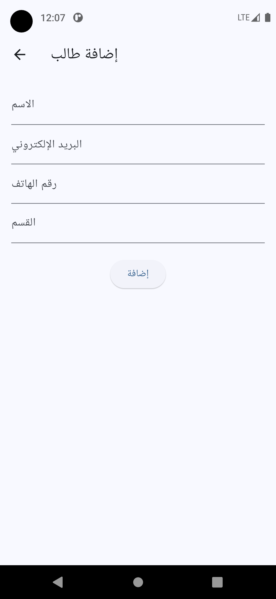
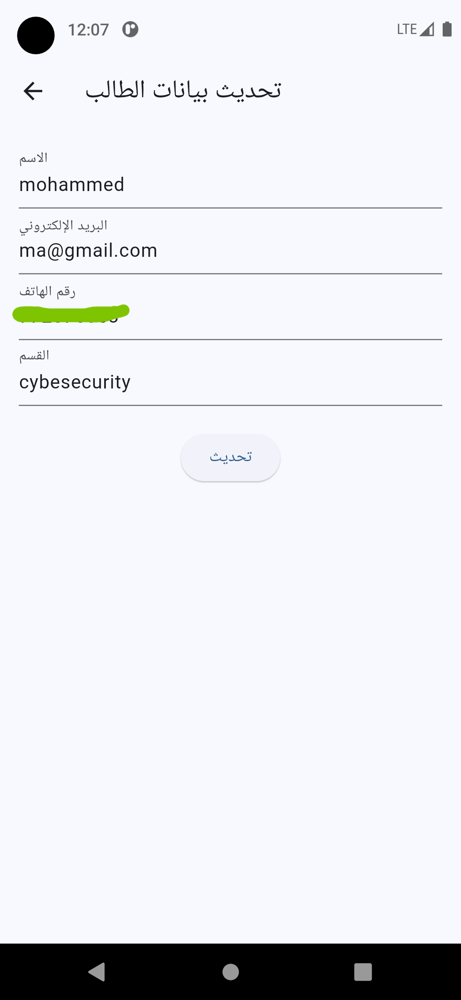
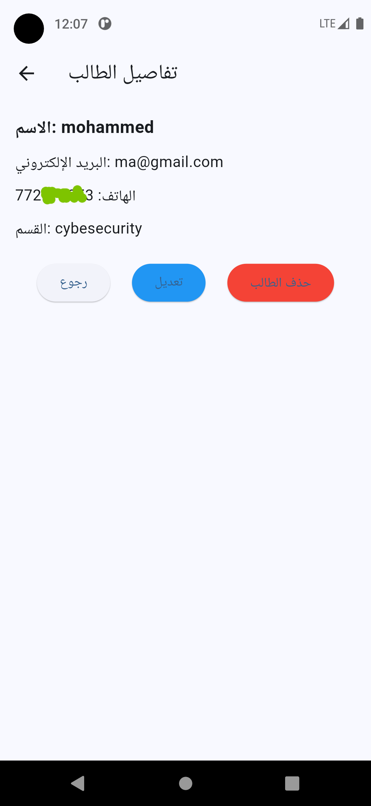

# 🎓 Student Data Manager

تطبيق Flutter شامل لإدارة بيانات الطلاب بسهولة واحترافية، يتضمن تسجيل دخول، إنشاء حساب، إدارة بيانات الطلاب، وواجهات أنيقة.

---

## 🖼️ صور من واجهات التطبيق

---
### 🔐 صفحة تسجيل الدخول


---
### 📝 صفحة إنشاء حساب


---
### 🏠 الصفحة الرئيسية


---

### 📋 قائمة الطلاب


---

### ➕ إضافة بيانات طالب


---

### ✏️ تعديل بيانات طالب


---

### 🔍 عرض بيانات طالب


---

## ⚙️ الميزات الرئيسية

- تسجيل دخول آمن وإنشاء حساب جديد.
- إضافة وتعديل وحذف وعرض بيانات الطلاب.
- قائمة منظمة لعرض جميع الطلاب.
- تخزين محلي للبيانات.
- تصميم واجهات أنيق باستخدام Flutter.

---

## 🚀 التشغيل السريع

لتشغيل المشروع على جهازك المحلي:

```bash
flutter pub get
flutter run
